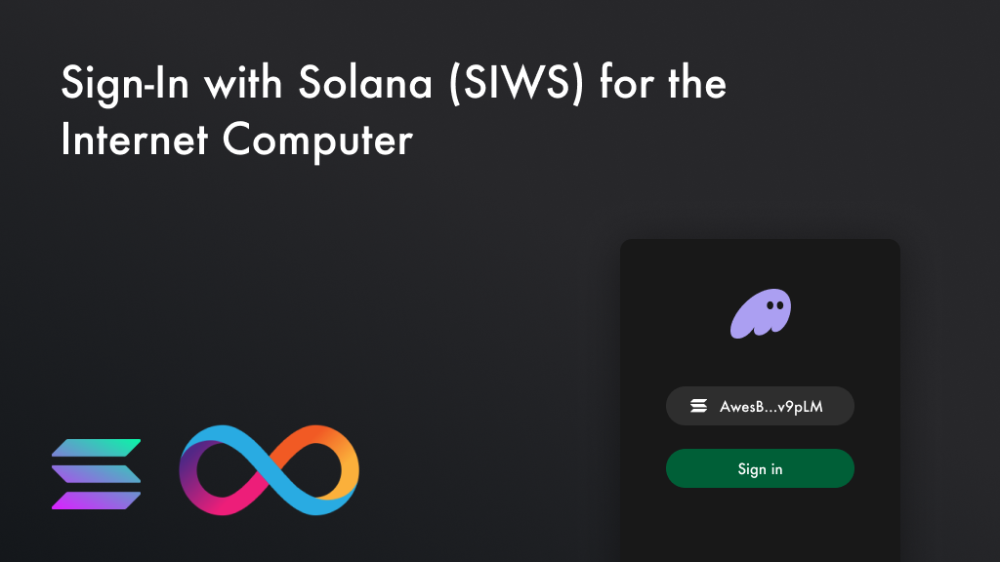

[![Crate][crate-image]][crate-link] [![Docs][docs-image]][docs-link]

`ic_siws` is a Rust library that facilitates the integration of Solana wallet-based authentication with applications on the Internet Computer (ICP) platform. The library provides all necessary tools for integrating Sign-In with Solna (SIWS) into ICP canisters, from generating SIWS messages to creating delegate identities.

`ic_siws` is part of the [ic-siws](https://github.com/kristoferlund/ic-siws) project. The goal of the project is to enhance the interoperability between Solana and the Internet Computer platform, enabling developers to build applications that leverage the strengths of both platforms.

## Key Features
- **Solana Wallet Sign-In**: Enables Solana wallet sign-in for ICP applications. Sign in with any eth wallet to generate an ICP identity and session.
- **Session Identity Uniqueness**: Ensures that session identities are specific to each application's context, preventing cross-app identity misuse.
- **Consistent Principal Generation**: Guarantees that logging in with a Solana wallet consistently produces the same Principal, irrespective of the client used.
- **Direct Solana Address to Principal Mapping**: Creates a one-to-one correlation between Solana addresses and Principals within the scope of the current application.
- **Timebound Sessions**: Allows developers to set expiration times for sessions, enhancing security and control.

## Also available

[ic-siwe](https://github.com/kristoferlund/ic-siwe) - The sibling project of `ic-siws`, `ic-siwe` offers the same functionality
for Ethereum-based applications.

## Table of Contents

- [Prebuilt `ic_siws_provider` canister](#prebuilt-ic_siws_provider-canister)
- [React demo application](#react-demo-application)
- [SIWS: Sign In With Solana](#siws-sign-in-with-solana)
- [Login flow](#login-flow)
  - [`siws_prepare_login`](#siws_prepare_login)
  - [`siws_login`](#siws_login)
  - [`siws_get_delegation`](#siws_get_delegation)
- [Crate features](#crate-features)
- [Updates](#updates)
- [Contributing](#contributing)
- [License](#license)

## Prebuilt `ic_siws_provider` canister

While the `ic_siws` library can be integrated with any Rust based ICP project, using the pre built [ic-siws-provider](https://github.com/kristoferlund/ic-siws/tree/main/packages/ic_siws_provider) canister is the easiest way to integrate Solana wallet authentication into your application.

The canister is designed as a plug-and-play solution for developers, enabling easy integration into existing ICP applications with minimal coding requirements. By adding the pre built `ic_siws_provider` canister to the `dfx.json` of an ICP project, developers can quickly enable Solana wallet-based authentication for their applications. The canister simplifies the authentication flow by managing the creation and verification of SIWS messages and handling user session management.

## React demo application

A demo application that uses the `ic_siws_provider` canister to demonstrate the full login flow is available at [ic-siws-react-demo-rust](https://github.com/kristoferlund/ic-siws-react-demo-rust). The demo uses another package from the `ic-siws` project, [ic-use-siws-identity](https://github.com/kristoferlund/ic-siws/tree/main/packages/ic-use-siws-identity), a React hook and context provider for easy frontend integration with SIWS enabled Internet Computer canisters.

## SIWS: Sign In With Solana

Sign In With Solana (SIWS) is a Solana wallet standard with broad support across the Solana ecosystem. It enables users to sign messages with their Solana wallets to authenticate themselves to dapps, streamlining the authentication process by standardizing message formats for improved user experience and security. Building on the principles established by [ERC-4361: Sign-In with Ethereum](https://eips.ethereum.org/EIPS/eip-4361), SIWS simplifies the authentication flow, eliminating the need for the traditional connect + signMessage steps.

At the core of the protocol is the SIWS message, which is a signed message that contains the Solana address of the user and some additional metadata. The SIWS message is signed by the user's Solana wallet and then sent to the application's backend. The backend verifies the signature and Solana address and then creates a session for the user.

`ic_siws` implements most parts of the Sign In with Solana standard, with some notable exceptions:

- `nonce` - SIWS requires that each sign-in message has a unique nonce. In the context of this implementation, the nonce don't add any additional security to the login flow and are disabled by default. If random nonces are required, the `nonce` feature flag can be enabled. When this feature is enabled, the nonce is generated using a cryptographically secure random number generator.

- `not-before`, `request-id`, `resources` - Not implemented. These fields are marked as OPTIONAL in the SIWS standard and are not currently implemented.

# Login flow

Creating a delegate identity using `ic_siws` is a three-step process that consists of the following steps:
1. Prepare login
2. Login
3. Get delegation

An implementing canister is free to implement these steps in any way it sees fit. It is recommended though that implementing canisters follow the login flow described below and implement the SIWS canister interface. Doing ensures that the canister is compatible with the [ic-use-siws-identity](https://github.com/kristoferlund/ic-siws/tree/main/packages/ic-use-siws-identity) React hook and context provider.

## SIWS canister interface

```text
type Address = text;
type CanisterPublicKey = PublicKey;
type PublicKey = blob;
type SessionKey = PublicKey;
type SiwsSignature = text;
type Timestamp = nat64;

type GetDelegationResponse = variant {
  Ok : SignedDelegation;
  Err : text;
};

type SignedDelegation = record {
  delegation : Delegation;
  signature : blob;
};

type Delegation = record {
  pubkey : PublicKey;
  expiration : Timestamp;
  targets : opt vec principal;
};

type LoginResponse = variant {
  Ok : LoginDetails;
  Err : text;
};

type LoginDetails = record {
  expiration : Timestamp;
  user_canister_pubkey : CanisterPublicKey;
};

type SiwsMessage = record {
  domain : text;
  address : Address;
  statement : text;
  uri : text;
  version : nat32;
  chain_id : text;
  nonce : text;
  issued_at : nat64;
  expiration_time : nat64;
};

type PrepareLoginResponse = variant {
  Ok : SiwsMessage;
  Err : text;
};

service : (settings_input : SettingsInput) -> {
  "siws_prepare_login" : (Address) -> (PrepareLoginResponse);
  "siws_login" : (SiwsSignature, Address, SessionKey) -> (LoginResponse);
  "siws_get_delegation" : (Address, SessionKey, Timestamp) -> (GetDelegationResponse) query;
};

```

## `siws_prepare_login`
- The `siws_prepare_login` method is called by the frontend application to initiate the login flow. The method takes the user's Solana address as a parameter and returns a SIWS message. The frontend application uses the SIWS message to prompt the user to sign the message with their Solana wallet.
- See: [`login::prepare_login`]

## `login`
- The `login` method is called by the frontend application after the user has signed the SIWS message. The method takes the user's Solana address, signature, and session identity as parameters. The method verifies the signature and Solana address and returns a delegation.
- See: [`login::login`]

## `siws_get_delegation`
- The `siws_get_delegation` method is called by the frontend application after a successful login. The method takes the delegation expiration time as a parameter and returns a delegation.
- The `siws_get_delegation` method is not mirrored by one function in the `ic_siws` library. The creation of delegate identities requires setting the certified data of the canister. This should not be done by the library, but by the implementing canister.
- Creating a delegate identity involves interacting with the following `ic_siws` functions: [`delegation::generate_seed`], [`delegation::create_delegation`] , [`delegation::create_delegation_hash`], [`delegation::witness`],
  [`delegation::create_certified_signature`].
- For a full implementation example, see the [`ic_siws_provider`](https://github.com/kristoferlund/ic-siws/tree/main/packages/ic_siws_provider) canister.

The login flow is illustrated in the following diagram:

```text
                                ┌────────┐                                        ┌────────┐                              ┌─────────┐
                                │Frontend│                                        │Canister│                              │SolWallet│
   User                         └───┬────┘                                        └───┬────┘                              └────┬────┘
    │      Push login button       ┌┴┐                                                │                                        │
    │ ────────────────────────────>│ │                                                │                                        │
    │                              │ │                                                │                                        │
    │                              │ │          siws_prepare_login(eth_address)      ┌┴┐                                       │
    │                              │ │ ─────────────────────────────────────────────>│ │                                       │
    │                              │ │                                               └┬┘                                       │
    │                              │ │                OK, siws_message                │                                        │
    │                              │ │ <─ ─ ─ ─ ─ ─ ─ ─ ─ ─ ─ ─ ─ ─ ─ ─ ─ ─ ─ ─ ─ ─ ─ ─                                        │
    │                              │ │                                                │                                        │
    │                              │ │                                   Sign siws_message                                    ┌┴┐
    │                              │ │ ──────────────────────────────────────────────────────────────────────────────────────>│ │
    │                              │ │                                                │                                       │ │
    │                              │ │                  Ask user to confirm           │                                       │ │
    │ <───────────────────────────────────────────────────────────────────────────────────────────────────────────────────────│ │
    │                              │ │                                                │                                       │ │
    │                              │ │                          OK                    │                                       │ │
    │  ─ ─ ─ ─ ─ ─ ─ ─ ─ ─ ─ ─ ─ ─ ─ ─ ─ ─ ─ ─ ─ ─ ─ ─ ─ ─ ─ ─ ─ ─ ─ ─ ─ ─ ─ ─ ─ ─ ─ ─ ─ ─ ─ ─ ─ ─ ─ ─ ─ ─ ─ ─ ─ ─ ─ ─ ─ ─ ─ >│ │
    │                              │ │                                                │                                       └┬┘
    │                              │ │                                      OK, signature                                      │
    │                              │ │ <─ ─ ─ ─ ─ ─ ─ ─ ─ ─ ─ ─ ─ ─ ─ ─ ─ ─ ─ ─ ─ ─ ─ ─ ─ ─ ─ ─ ─ ─ ─ ─ ─ ─ ─ ─ ─ ─ ─ ─ ─ ─ ─ ─
    │                              │ │                                                │                                        │
    │                              │ │────┐                                           │                                        │
    │                              │ │    │ Generate random session_identity          │                                        │
    │                              │ │<───┘                                           │                                        │
    │                              │ │                                                │                                        │
    │                              │ │             siws_login(eth_address,            │                                        │
    │                              │ │          signature, session_identity)         ┌┴┐                                       │
    │                              │ │ ─────────────────────────────────────────────>│ │                                       │
    │                              │ │                                               │ │                                       │
    │                              │ │                                               │ │────┐                                  │
    │                              │ │                                               │ │    │ Verify signature and eth_address │
    │                              │ │                                               │ │<───┘                                  │
    │                              │ │                                               │ │                                       │
    │                              │ │                                               │ │────┐                                  │
    │                              │ │                                               │ │    │ Prepare delegation               │
    │                              │ │                                               │ │<───┘                                  │
    │                              │ │                                               └┬┘                                       │
    │                              │ │     OK, canister_pubkey, delegation_expires    │                                        │
    │                              │ │ <─ ─ ─ ─ ─ ─ ─ ─ ─ ─ ─ ─ ─ ─ ─ ─ ─ ─ ─ ─ ─ ─ ─ ─                                        │
    │                              │ │                                                │                                        │
    │                              │ │     siws_get_delegation(delegation_expires)   ┌┴┐                                       │
    │                              │ │ ─────────────────────────────────────────────>│ │                                       │
    │                              │ │                                               └┬┘                                       │
    │                              │ │                 OK, delegation                 │                                        │
    │                              │ │ <─ ─ ─ ─ ─ ─ ─ ─ ─ ─ ─ ─ ─ ─ ─ ─ ─ ─ ─ ─ ─ ─ ─ ─                                        │
    │                              │ │                                                │                                        │
    │                              │ │────┐                                           │                                        │
    │                              │ │    │ Create delegation identity                │                                        │
    │                              │ │<───┘                                           │                                        │
    │                              └┬┘                                                │                                        │
    │ OK, logged in with            │                                                 │                                        │
    │ Principal niuiu-iuhbi...-oiu  │                                                 │                                        │
    │ <─ ─ ─ ─ ─ ─ ─ ─ ─ ─ ─ ─ ─ ─ ─                                                  │                                        │
  User                          ┌───┴────┐                                        ┌───┴────┐                              ┌────┴────┐
                                │Frontend│                                        │Canister│                              │SolWallet│
                                └────────┘                                        └────────┘                              └─────────┘
```

# Crate features

The library has one optional feature that is disabled by default.

* `nonce` - Enables the generation of nonces for SIWS messages. This feature initializes a random number generator with a seed from the management canister. The random number generator then is used to generate unique nonces for each generated SIWS message. Nonces don't add any additional security to the SIWS login flow but are required by the SIWS standard. When this feature is disabled, the nonce is always set to the hex encoded string `Not in use`.

## Updates

See the [CHANGELOG](https://github.com/kristoferlund/ic-siws/blob/main/packages/ic_siws/CHANGELOG.md) for details on updates.

## Contributing

Contributions are welcome. Please submit your pull requests or open issues to propose changes or report bugs.

## Author

- [kristofer@fmckl.se](mailto:kristofer@fmckl.se)
- Twitter: [@kristoferlund](https://twitter.com/kristoferlund)
- Discord: kristoferkristofer
- Telegram: [@kristoferkristofer](https://t.me/kristoferkristofer)

## License

This project is licensed under the MIT License. See the LICENSE file for more details.

[crate-image]: https://buildstats.info/crate/ic_siws
[crate-link]: https://crates.io/crates/ic_siws
[docs-image]: https://docs.rs/ic_siws/badge.svg
[docs-link]: https://docs.rs/ic_siws/